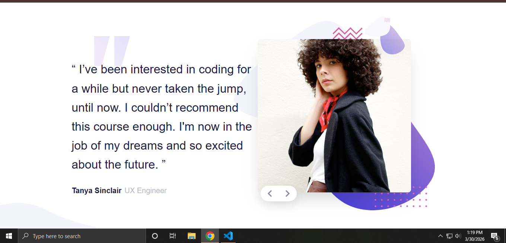

# Frontend Mentor - Coding bootcamp testimonials slider solution

This is a solution to the [Coding bootcamp testimonials slider challenge on Frontend Mentor](https://www.frontendmentor.io/challenges/coding-bootcamp-testimonials-slider-97q19EB1i). Frontend Mentor challenges help you improve your coding skills by building realistic projects. 

## Table of contents

- [Overview](#overview)
  - [The challenge](#the-challenge)
  - [Screenshot](#screenshot)
  - [Links](#links)
- [My process](#my-process)
  - [Built with](#built-with)
  - [What I learned](#what-i-learned)
- [Author](#author)

## Overview

### The challenge

Users should be able to:

- View the optimal layout for the component depending on their device's screen size
- Navigate through the testimonials using the buttons
- Navigate through the testimonials using the keyboard (Left/Right arrows)

### Screenshot



### Links

- Solution URL: [https://github.com/dreamer111111/Coding-Bootcamp-Testimonials-Slider-html-css-js]
- Live Site URL: [https://coding-bootcamp-testimonials-slider-one.vercel.app/]
## My process

### Built with

- Semantic HTML5 markup
- CSS Custom Properties (Variables)
- Flexbox & CSS Grid
- Mobile-first workflow
- Vanilla JavaScript (Data-driven UI)
- Relative units (`rem`, `em`, `%`) for better accessibility

### What I learned

In this project, I focused on moving away from hardcoded HTML and using JavaScript to manage application state. 

**1. Data-Driven UI:**
Instead of creating multiple cards in HTML, I stored the data in a JavaScript array. This makes the application much easier to maintain and scale.

```javascript
const testimonials = [
  {
    name: "Tanya Sinclair",
    role: "UX Engineer",
    quote: "...",
    image: "images/image-tanya.jpg"
  }
];
```

Author

Frontend Mentor - @dreamer111111 [https://www.frontendmentor.io/profile/dreamer111111]
